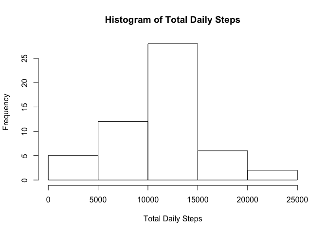
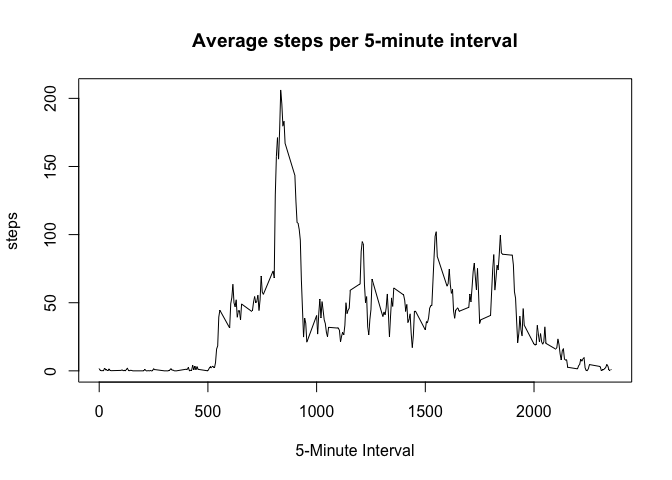
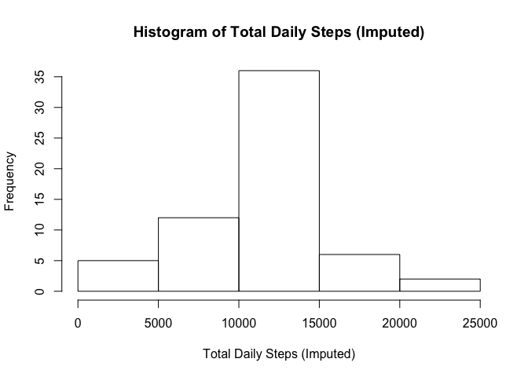
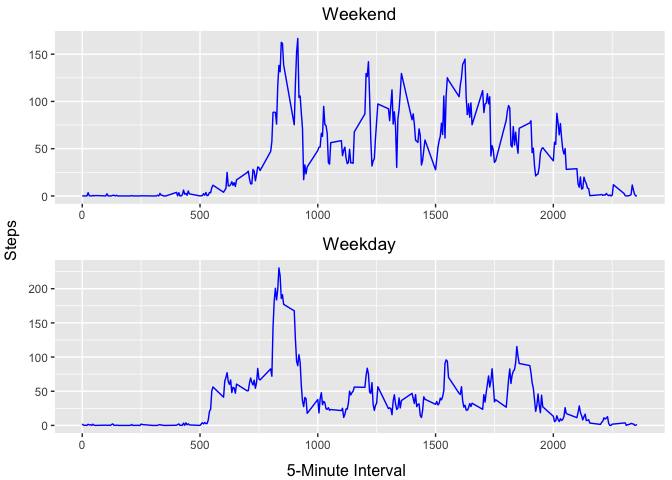

This report will answer a few questions about the physical activity data provided in this assignment.

## Load and process the data

First we will load and process the data. The data has been downloaded and stored in a "Data" folder off the root directory off the R workind directory.


```r
library(knitr)

data <- read.csv(file = "Data/activity.csv")
data$date <- as.Date(as.character(data$date))
```

Next we will review the structure of the data

```r
str(data)
```

```
## 'data.frame':	17568 obs. of  3 variables:
##  $ steps   : int  NA NA NA NA NA NA NA NA NA NA ...
##  $ date    : Date, format: "2012-10-01" "2012-10-01" ...
##  $ interval: int  0 5 10 15 20 25 30 35 40 45 ...
```

## 1: What is mean total number of steps taken per day?

First, we will find the total steps taken each day.


```r
StepsByDay <- aggregate(data$steps, list(data$date), sum)
colnames(StepsByDay) <- c("interval", "steps")
print(StepsByDay)
```

```
##      interval steps
## 1  2012-10-01    NA
## 2  2012-10-02   126
## 3  2012-10-03 11352
## 4  2012-10-04 12116
## 5  2012-10-05 13294
## 6  2012-10-06 15420
## 7  2012-10-07 11015
## 8  2012-10-08    NA
## 9  2012-10-09 12811
## 10 2012-10-10  9900
## 11 2012-10-11 10304
## 12 2012-10-12 17382
## 13 2012-10-13 12426
## 14 2012-10-14 15098
## 15 2012-10-15 10139
## 16 2012-10-16 15084
## 17 2012-10-17 13452
## 18 2012-10-18 10056
## 19 2012-10-19 11829
## 20 2012-10-20 10395
## 21 2012-10-21  8821
## 22 2012-10-22 13460
## 23 2012-10-23  8918
## 24 2012-10-24  8355
## 25 2012-10-25  2492
## 26 2012-10-26  6778
## 27 2012-10-27 10119
## 28 2012-10-28 11458
## 29 2012-10-29  5018
## 30 2012-10-30  9819
## 31 2012-10-31 15414
## 32 2012-11-01    NA
## 33 2012-11-02 10600
## 34 2012-11-03 10571
## 35 2012-11-04    NA
## 36 2012-11-05 10439
## 37 2012-11-06  8334
## 38 2012-11-07 12883
## 39 2012-11-08  3219
## 40 2012-11-09    NA
## 41 2012-11-10    NA
## 42 2012-11-11 12608
## 43 2012-11-12 10765
## 44 2012-11-13  7336
## 45 2012-11-14    NA
## 46 2012-11-15    41
## 47 2012-11-16  5441
## 48 2012-11-17 14339
## 49 2012-11-18 15110
## 50 2012-11-19  8841
## 51 2012-11-20  4472
## 52 2012-11-21 12787
## 53 2012-11-22 20427
## 54 2012-11-23 21194
## 55 2012-11-24 14478
## 56 2012-11-25 11834
## 57 2012-11-26 11162
## 58 2012-11-27 13646
## 59 2012-11-28 10183
## 60 2012-11-29  7047
## 61 2012-11-30    NA
```

Next we will make a histogram of the total number of steps taken each day.

```r
hist(StepsByDay$steps, main = "Histogram of Total Daily Steps", xlab = "Total Daily Steps")
```

<!-- -->

Lastly for this question, we will calculate the mean and median of the total number of steps taken per day.

```r
DailyStepsMean <- mean(StepsByDay$steps, na.rm = T)
print(DailyStepsMean)
```

```
## [1] 10766.19
```

```r
DailyStepsMedian <- median(StepsByDay$steps, na.rm = T)
print(DailyStepsMedian)
```

```
## [1] 10765
```

## 2: What is the average daily activity pattern?

We will now look at the average numbers of steps by 5-minute interval across all the days in the data.

```r
# Remove NA values then calculate average steps in each 5-minute interval.
dataNoNA <- na.omit(data)
StepsByInterval <- aggregate(dataNoNA$steps, list(dataNoNA$interval), mean)
colnames(StepsByInterval) <- c("interval", "steps")

# Make a time series plot of average steps in each 5-minute interval.
plot(StepsByInterval, type = "l", main = "Average steps per 5-minute interval", xlab = "5-Minute Interval")
```

<!-- -->

Now we want to know which 5-minute interval has on-average the most number of steps.

```r
StepsByInterval[which.max(StepsByInterval$steps), ]
```

```
##     interval    steps
## 104      835 206.1698
```

## 3: Imputing missing values

Let's take a closer look at missing values in the data set, starting with the number of 5-minute intervals that are missing values.


```r
NAIntervals <- sum(is.na(data$steps))
```

There are 2304 5-minute intervals missing a value.

Next we will impute values for the missing data by inserting the mean steps by interval for the intervals that are currently missing data.

```r
colnames(StepsByInterval) <- c("interval", "steps")
dataImputed <- merge(data, StepsByInterval, by = "interval", suffixes = c(".data", ".StepsByInterval"))
colnames(dataImputed) <- c("interval", "steps", "date", "AvgStepsByInterval")
dataImputed$steps <- ifelse(is.na(dataImputed$steps), dataImputed$AvgStepsByInterval, dataImputed$steps)
```


```r
StepsByDayImputed <- aggregate(dataImputed$steps, list(dataImputed$date), sum)
colnames(StepsByDayImputed) <- c("interval", "steps")
print(StepsByDayImputed)
```

```
##      interval    steps
## 1  2012-10-01 10766.19
## 2  2012-10-02   126.00
## 3  2012-10-03 11352.00
## 4  2012-10-04 12116.00
## 5  2012-10-05 13294.00
## 6  2012-10-06 15420.00
## 7  2012-10-07 11015.00
## 8  2012-10-08 10766.19
## 9  2012-10-09 12811.00
## 10 2012-10-10  9900.00
## 11 2012-10-11 10304.00
## 12 2012-10-12 17382.00
## 13 2012-10-13 12426.00
## 14 2012-10-14 15098.00
## 15 2012-10-15 10139.00
## 16 2012-10-16 15084.00
## 17 2012-10-17 13452.00
## 18 2012-10-18 10056.00
## 19 2012-10-19 11829.00
## 20 2012-10-20 10395.00
## 21 2012-10-21  8821.00
## 22 2012-10-22 13460.00
## 23 2012-10-23  8918.00
## 24 2012-10-24  8355.00
## 25 2012-10-25  2492.00
## 26 2012-10-26  6778.00
## 27 2012-10-27 10119.00
## 28 2012-10-28 11458.00
## 29 2012-10-29  5018.00
## 30 2012-10-30  9819.00
## 31 2012-10-31 15414.00
## 32 2012-11-01 10766.19
## 33 2012-11-02 10600.00
## 34 2012-11-03 10571.00
## 35 2012-11-04 10766.19
## 36 2012-11-05 10439.00
## 37 2012-11-06  8334.00
## 38 2012-11-07 12883.00
## 39 2012-11-08  3219.00
## 40 2012-11-09 10766.19
## 41 2012-11-10 10766.19
## 42 2012-11-11 12608.00
## 43 2012-11-12 10765.00
## 44 2012-11-13  7336.00
## 45 2012-11-14 10766.19
## 46 2012-11-15    41.00
## 47 2012-11-16  5441.00
## 48 2012-11-17 14339.00
## 49 2012-11-18 15110.00
## 50 2012-11-19  8841.00
## 51 2012-11-20  4472.00
## 52 2012-11-21 12787.00
## 53 2012-11-22 20427.00
## 54 2012-11-23 21194.00
## 55 2012-11-24 14478.00
## 56 2012-11-25 11834.00
## 57 2012-11-26 11162.00
## 58 2012-11-27 13646.00
## 59 2012-11-28 10183.00
## 60 2012-11-29  7047.00
## 61 2012-11-30 10766.19
```

With the imputed data set, we will now make a histogram of the total number of steps taken each day.

```r
hist(StepsByDayImputed$steps, main = "Histogram of Total Daily Steps (Imputed)", xlab = "Total Daily Steps (Imputed)")
```

<!-- -->

Lastly for this question, we will calculate the mean and median of the total number of steps taken per day using this imputed data set.

```r
DailyStepsMeanImputed <- mean(StepsByDayImputed$steps, na.rm = T)
print(DailyStepsMeanImputed)
```

```
## [1] 10766.19
```

```r
DailyStepsMedianImputed <- median(StepsByDayImputed$steps, na.rm = T)
print(DailyStepsMedianImputed)
```

```
## [1] 10766.19
```

Question: Do these values differ from the values calculated using non-imputed data?
There is very little variance with the mean being the same and the median varying by a fraction of a percentage.

Question: What is the impact of imputing missing data on the estimates of the total daily number of steps?
The range of total daily steps remains the same, but there are now more days in the 10,000 - 15,000 range as shown by the increased peak in the histogram.

## 4: Are there differences in activity patterns between weekdays and weekends?

To answer this question we must first introduce "weekday" and "weekend" factors into the data. We will continue with the imputed data.

```r
dataImputed$Day <- weekdays(dataImputed$date, abbreviate = T)
dataImputed$Day <- ifelse(dataImputed$Day == "Sat" | dataImputed$Day == "Sun", "Weekend", "Weekday")
```

Lastly, we will look at the average numbers of steps by 5-minute interval across weekends and weekdays to see if there appers to be a significant difference.

```r
# Calculate average steps in each 5-minute interval for weekdays and weekends.
dataImputedWeekday <- subset(dataImputed, Day == "Weekday")
StepsByIntervalImputedWeekday <- aggregate(dataImputedWeekday$steps, list(dataImputedWeekday$interval), mean)

dataImputedWeekend <- subset(dataImputed, Day == "Weekend")
StepsByIntervalImputedWeekend <- aggregate(dataImputedWeekend$steps, list(dataImputedWeekend$interval), mean)

colnames(StepsByIntervalImputedWeekday) <- c("interval", "steps")
colnames(StepsByIntervalImputedWeekend) <- c("interval", "steps")

# Make time series plots of average steps in each 5-minute interval for weekends and weedays
# par(mfrow = c(2, 1))
# plot(StepsByIntervalImputedWeekday, type = "l", main = "Average steps per 5-minute interval", xlab = "5-Minute Interval")
# plot(StepsByIntervalImputedWeekend, type = "l", main = "Average steps per 5-minute interval", xlab = "5-Minute Interval")

library(ggplot2)
library(gridExtra)

WeekdayPlot <- ggplot(StepsByIntervalImputedWeekday, aes(interval, steps)) + geom_line(color = "blue") + ggtitle("Weekday") + theme(axis.title = element_blank(), plot.title = element_text(hjust = 0.5))

WeekendPlot <- ggplot(StepsByIntervalImputedWeekend, aes(interval, steps)) + geom_line(color = "blue") + ggtitle("Weekend") + theme(axis.title = element_blank(), plot.title = element_text(hjust = 0.5))

grid.arrange(WeekendPlot, WeekdayPlot, nrow = 2, bottom = "5-Minute Interval", left = "Steps")
```

<!-- -->

